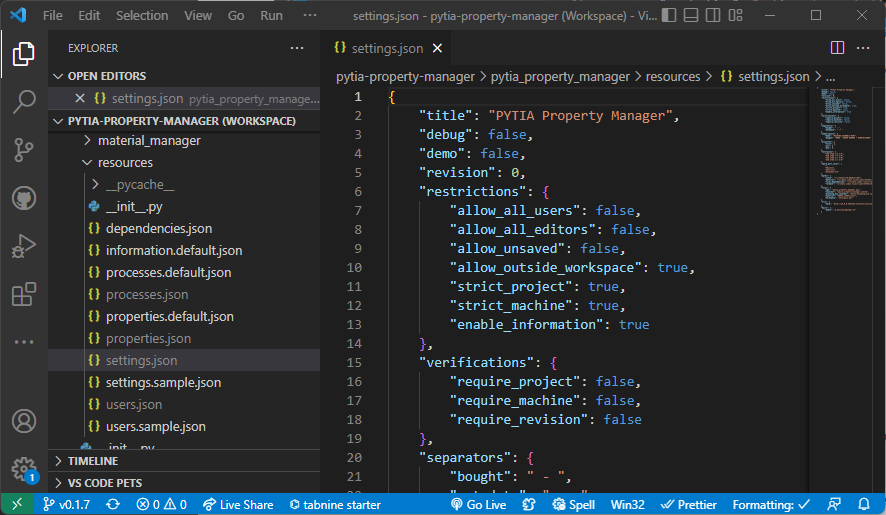
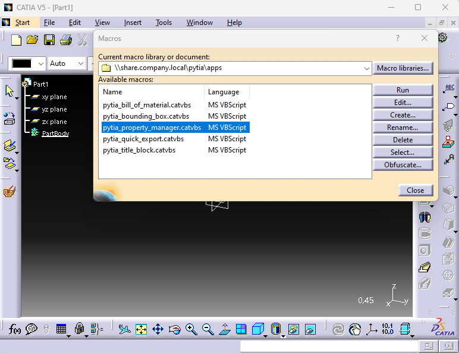

# installation

> ✏️ The installation process for this app requires a lot of work and has several important steps to follow. This is because all pytia apps are a result of opening the source to the public without changing the installation to something more convenient.
>
> ⚠️ This guide covers:
>
> - Developer: Install the complete development environment to change and configure the apps settings
> - User: Setup the users computer for an automatic installation on their machine (the user should not be required to use dev tools)
> - CATIA: How to setup CATIA for the apps
>
> ✏️ Every app must be built first on the developers' machine, then distributed to a shared location, which all users can access. This might be a shared network drive or a cloud service like OneDrive. If you intend to use the apps only for yourself, you can distribute the apps anywhere to your computer.
>
> ✏️ All images of this guide are from the installation of the `pytia-property-manager` app. This will be changed in the future, when there is more time.

**Table of contents**:

- [installation](#installation)
  - [1 development environment](#1-development-environment)
    - [1.1 required software](#11-required-software)
      - [1.1.1 installation folder](#111-installation-folder)
      - [1.1.2 install catia](#112-install-catia)
      - [1.1.3 install git](#113-install-git)
      - [1.1.4 install python](#114-install-python)
      - [1.1.5 install vs code](#115-install-vs-code)
    - [1.2 install the app](#12-install-the-app)
      - [1.2.1 clone the repository](#121-clone-the-repository)
      - [1.2.2 setup the code workspace](#122-setup-the-code-workspace)
      - [1.2.3 select the version](#123-select-the-version)
      - [1.2.4 install the dependencies](#124-install-the-dependencies)
    - [1.3 configure the app](#13-configure-the-app)
      - [1.3.1 default files](#131-default-files)
      - [1.3.2 sample files](#132-sample-files)
    - [1.4 build the app](#14-build-the-app)
    - [1.5 release the app](#15-release-the-app)
    - [1.6 update the app](#16-update-the-app)
  - [2 user environment](#2-user-environment)
    - [2.1 required software](#21-required-software)
      - [2.1.1 python on the users machine](#211-python-on-the-users-machine)
  - [3 catia setup](#3-catia-setup)
    - [3.1 edit catia environment file](#31-edit-catia-environment-file)
    - [3.2 add the pytia app to the catia toolbar](#32-add-the-pytia-app-to-the-catia-toolbar)
    - [3.3 reference setting](#33-reference-setting)
      - [3.3.1 shared network drive](#331-shared-network-drive)
      - [3.3.2 cloud service](#332-cloud-service)
  - [4 run the app](#4-run-the-app)

## 1 development environment

### 1.1 required software

Install the following software on your machine:

- CATIA V5 6R2023 or higher
- [Python](https://www.python.org/downloads/)
- [Git](https://gitforwindows.org/)
- [Poetry](https://python-poetry.org/docs/master/#installation)
- [Git](https://git-scm.com/downloads) or [GitHub Desktop](https://desktop.github.com/)

#### 1.1.1 installation folder

On the developer's machine (or the computer, from which you want to distribute the app), create a folder for the source code. In this example the app is stored in `C:\pytia\`, but feel free to keep the apps' source code on your machine anywhere you like.

> ✏️ This folder is not the place where the app is located to be used by users. It is the location into which the app is to be downloaded and built.

#### 1.1.2 install catia

Install catia as described in your releases' guide. Then add the following line at the end of the environment file:

- DEACTIVATE_SHEETMETAL_WARNING_AT_PART_OPEN=Yes

#### 1.1.3 install git

Download and install [git for windows](https://gitforwindows.org/). Git is required to handle the versions of the pytia apps.

Some default values you may want to use for the installation are:

- Add git bash profile to windows terminal
- Use visual studio code as git's default editor
- Overwrite the default branch name: main
- Use git from the command line and from 3rd party software
- Use bundled OpenSSH
- Use OpenSSL library
- Checkout Windows style, commit Unix-style
- Use windows default console window

Download the [GitHub desktop app](https://desktop.github.com/) and install it. This app is required to clone the pytia app repository to your local machine.

> ✏️ You're going to need a GitHub account for this app.
>
> ✏️ If you know your ways with the git cli you can skip the installation of GitHub desktop and handle everything in the terminal.

#### 1.1.4 install python

> ✏️ Already installed the required python version? Then skip this step.

Install python for windows using the following commands:

```bash
$source = "https://www.python.org/ftp/python/3.10.7/python-3.10.7-amd64.exe"
$downloads = (New-Object -ComObject Shell.Application).NameSpace('shell:Downloads').Self.Path
$destination = "$($downloads)\python-3.10.7-amd64.exe"
Invoke-WebRequest -Uri $source -OutFile $destination
```

After the download is completed install python using the following command:

```bash
Start-Process -FilePath $destination -ArgumentList "/passive PrependPath=1 Include_doc=0 Include_test=0 SimpleInstall=1"
```


After the installation verify the python version: `python -V`


#### 1.1.5 install vs code

Download and install the [VS Code Editor](https://code.visualstudio.com/download). You will need this editor to select the correct version of the pytia app and to apply the correct settings.

### 1.2 install the app

> ✏️ If you're comfortable with poetry, use it for handling the apps virtual environment and installing its dependencies. The jump right to chapter `1.3`.
>
> If you're new to virtual environments in python follow the guide.

#### 1.2.1 clone the repository

Head over to the [github repository](https://github.com/deloarts/pytia-reorder-tree), click the green code button and select https in the clone-section. Copy that link.


Now open GitHub Desktop and got to *File/Clone* and enter the copied repository url and the path, where you want to clone the repository into. Change the local path to your pytia folder, which you have set in chapter `1.1.1`.


The app will now clone the repository. This may take a while, depending on your network speed and the size of the repository.

#### 1.2.2 setup the code workspace

Now open VS Code and click **File/Add folder to workspace**. Select the repository folder where you have just cloned the app into. In this example it's `C:\pytia\pytia-reorder-tree`.

VS Code will now ask you if you want to install add-on that match your setup. Click yes.

Now open a new terminal in VS Code via **Terminal/New Terminal** and create a new virtual environment for building the app. When you start the terminal, you should already be in the working directory. Then type:

`python -m venv .env`


After python created a virtual environment for you in `C:\pytia\pytia-reorder-tree\.env\` you need to tell VS Code tell VS Code that it shall use this environment for the app. Do this by opening the [_build.py](../_build.py) python file. Then at the bottom of the editor there will be a small info field telling you the current python version.


Click it and then select the encapsuled python from the following folder `C:\pytia\pytia-reorder-tree\.env\Scripts\python.exe`. Keep in mind that your pytia-folder may be located somewhere else.

Now VS Code knows where the apps python version is to find. Now you have to activate it. Type:

`.env\Scripts\activate`


#### 1.2.3 select the version

Select your desired version of the app in VS Code. In this guides case it's `0.1.7`. Use the newest version to be up to date. This will load the correct config files for you.


Note: Only the latest versions of the pytia apps are compatible with another.

#### 1.2.4 install the dependencies

For this to work you need to have the virtual environment activate, see the chapter before. Go to the terminal in VS Code and type:

`python -m pip install -r requirements.txt`


### 1.3 configure the app

There are several config file for you to edit. The configuration is done via json files. In every pytia app they are located in the resources folder. In this example the full path is `C:\pytia\pytia-reorder-tree\pytia_reorder_tree\resources\.`. There are two types of config files you can edit:

- *.default.json
- *.sample.json

Files that don't have the default or sample keyword in them are not to be edited!

> ✏️ A detailed description of what you can change in any config files is in the [docs](../docs/) folder of this repository.

#### 1.3.1 default files

Default files are files that can be left as they are, if you are happy with their configuration. But if you want to edit those files, don't just do that inside this file. You have to copy, paste and rename this file. When renaming: Just get rid of the default keyword (`properties.default.json` becomes `properties.json`).


#### 1.3.2 sample files

Sample files are files that **must** be copied and renamed (`settings.sample.json` becomes `settings.json`). Do this for all sample files and edit them to fit your needs.



> ✏️ Be careful with shared network paths: Make sure you enter the full resolved path. Contact your system administrator if you're unsure.
>
> ✏️ I recommend to use the same release folder for all pytia apps (settings.json/paths/release).

### 1.4 build the app

Now it's time to build the app. Open the [_build.py](../_build.py) python file and click the small play button in the top right corner of VS Code. This will start the build script.


This will bundle everything (including your configuration made in the .sample and .default files) in one python-zip-file.

### 1.5 release the app

After you successfully built the app you have to release it. Open the [_release.py](../_release.py) file and hit the play button once again. This will copy the app and the launcher to the path you have specified in the `settings.json`.

> ❓ What is the launcher? In order to start the app from within CATIA you need a catvbs file. CATIA doesn't recognize python files, so you have to provide a catvbs file. At the end of this guide you'll find how to add the app to CATIA in a toolbar.

✏️ The moment you build the app using the [_build.py](../_build.py) script the paths you've specified in the `settings.json` config file are written to the launcher-catvbs file. If you want to move the pytia app later you have to build and release it again. You **cannot** just move the app, because the launcher won't find it.

### 1.6 update the app

If a new version of the app is available on github you have to select it in VS Code the same way as before. Do the whole build and release process again.

> ✏️ Some updates break existing config file. See the release notes on github to find out if it's save to update.

If you just do a change in the config you can do this safely without checking for a new version. Just change the config file as you wish and the to the build and release process once again.

## 2 user environment

### 2.1 required software

Install the following software on the users machine:

- CATIA V5 6R2023 or higher
- [Python](https://www.python.org/downloads/)

#### 2.1.1 python on the users machine

Install python 3.10.7 on the users machine, the recommended python install options are:

```powershell
python-installer.exe /passive PrependPath=1 Include_doc=0 Include_test=0 SimpleInstall=1 SimpleInstallDescription="python for pytia"
```

For convenience there is a powershell script that will install the required python version for you, see [assets/python_installer.ps1](assets/python_installer.ps1).

> ⚠️ Do not manually install any dependencies on the users machine. The app installs all required packages on its own.

On the users machine you need to install the following:

> ✏️ When the user starts the app it will automatically install all its requirements. Further the app also updates outdated dependencies if needed. The apps environment will be created in the users appdata-folder: `C:\Users\User\AppData\Roaming\pytia\pytia_reorder_tree`.

## 3 catia setup

### 3.1 edit catia environment file

For all pytia apps to work as intended you may want to add the following settings to the bottom of the environment file:

ENV VAR | ENV VALUE | Dexcription
--- | --- | ---
DEACTIVATE_SHEETMETAL_WARNING_AT_PART_OPEN | yes | If you use a stack export with the [bill of material](https://github.com/deloarts/pytia-bill-of-material) app and you have some parts designed in the sheet metal environment you may want to set this variable. Otherwise you will get a warning at every opening of an sheet metal part document, which defeats the intention of an automated export.

### 3.2 add the pytia app to the catia toolbar

> ✏️ If you run into trouble running any macro in CATIA or if you're unable to add a macro to your toolbar contact you CATIA administrator.

First make sure that the macro path in CATIA is the same as the release path you specified in the `settings.json`.

Then open the macro explorer in CATIA via **Tools/Macros/Macros...**. Add the release folder, then you will see all macros available in the list.



Proceed with adding the macro to the CATIA toolbar (you have to create that toolbar first).


### 3.3 reference setting

If you want to provide a consistent basic setup of your CATIA environment, you may want to provide an altered version of the `Scripting.CATSettings` file in the CAT-Reference setting folder. The goal is that every CATIA for user accesses the same folder when using the apps. To do so:

- Export the `Scripting.CATSettings` file from your CAT-User settings folder as XML
- Change the value of the `DefaultMacroLibraries` attribute (see snippet below)
- Import the edited XML file back into CATIA
- Move the updated `Scripting.CATSettings` file to your CAT-Reference setting folder

#### 3.3.1 shared network drive

The value for the `DefaultMacroLibraries` may look like this, if you want to use a shared network drive as a common folder:

```xml
<Attribute Name="DefaultMacroLibraries" Type="CATUnicodeString" Size="1">
<Value>\\shared_drive_name\CATIA\Apps</Value>
</Attribute>
```

The above example only works, if every user has access to the drive.

#### 3.3.2 cloud service

The value for the `DefaultMacroLibraries` may look like this, if you want to use OneDrive as a common folder:

```xml
<Attribute Name="DefaultMacroLibraries" Type="CATUnicodeString" Size="1">
<Value>${ONEDRIVE}\CATIA\Apps</Value>
</Attribute>
```

The above example only works, if `ONEDRIVE` is a valid user environment variable on every machine.

## 4 run the app

Now you can launch the app using the catvbs-macro in CATIA (using the toolbar you created earlier). The first time you click on the macro in CATIA you will see the installer:


After the installer has finished you can run the app.


